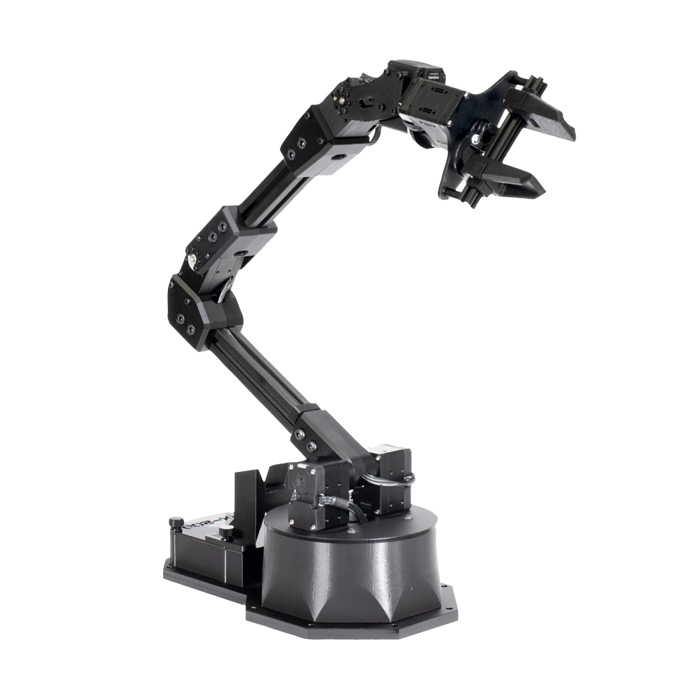
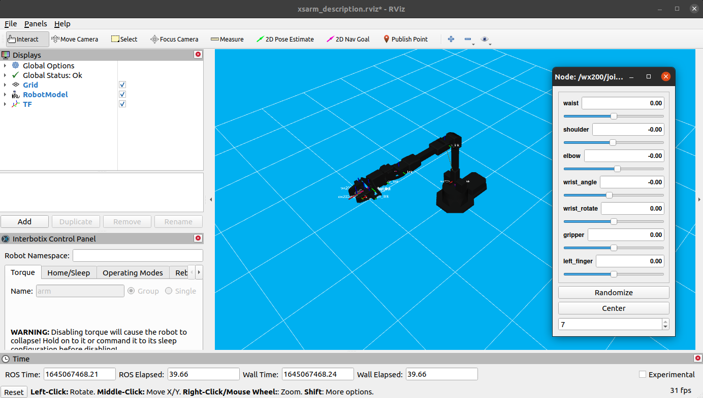

# RX200 Pick & Place using ROS2 and MoveIt

A ROS2 and MoveIt-based system for controlling the RX200 robotic arm through GUI-driven pick-and-place execution.

This project implements a pick-and-place system for the ReactorX-200 robotic arm using ROS2 and MoveIt. It includes a GUI for coordinate input and an action client for motion execution.

---

## Robot Model



---

## Features

- Pick and place execution using MoveIt
- GUI-based coordinate input (Tkinter)
- Inverse kinematics validation before execution
- ROS2 action client for motion control

---

## System Overview

The system consists of two main components:

- **GUI Publisher**
  - Built with Tkinter
  - Publishes target coordinates
  - Performs IK/reachability checks

- **MoveIt Action Client**
  - Receives pick/place coordinates
  - Plans and executes motion using MoveIt

---

## Requirements

- ROS2
- MoveIt2
- Interbotix MoveIt packages
- Python 3

---

## Installation

```bash

git clone https://github.com/yourusername/rx200-moveit-control-project.git
cd rx200-moveit-control-project
colcon build
source install/setup.bash

```
--- 

## How to Run

### Using Launch File

### Terminal 1 — Launch Robot System

```bash 


colcon build
source install/setup.bash
ros2 launch rx200_moveit_control launch_all.launch.py robot_type:=actual default_gripper_state:=false

``` 

> Use `robot_type:=fake` for simulation instead of the real robot.

### Terminal 2 — Run GUI

Open a new terminal and run:

```bash

source install/setup.bash
ros2 run rx200_moveit_control keyboard_gui
```
--- 


## Visualization



---

## Project Structure

```

src/
└── rx200_moveit_control/
images/
README.md

```

---